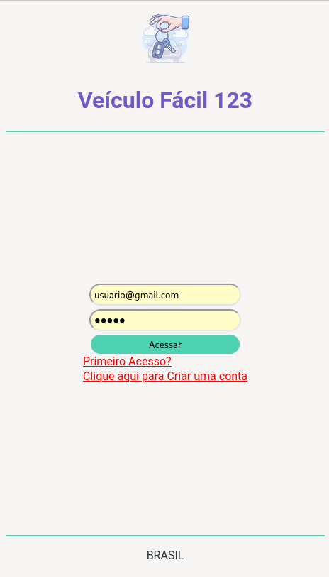

# Projeto Integrador
Projeto integrador da matéria 2203-PROJETO INTEGRADOR: DESENVOLVIMENTO DE SISTEMAS ORIENTADO A DISPOSITIVOS MÓVEIS E BASEADOS NA WEB

# Integrantes do Grupo 17:
Fabricio Macedo Crispim, 
Aïcha Abibatou Souza Gueye, 
Daniel dos Anjos Veleda, 
Gabriel Christino Cordeiro dos Santos, 
Gabriel Eugenio de Oliveira 

# Como acessar?
Na tela de login, utilizar o usuário **usuario@gmail.com** e a senha **12345**
 

As informações estão "mokadas" no código, não há uma conexão real com um banco de dados.
