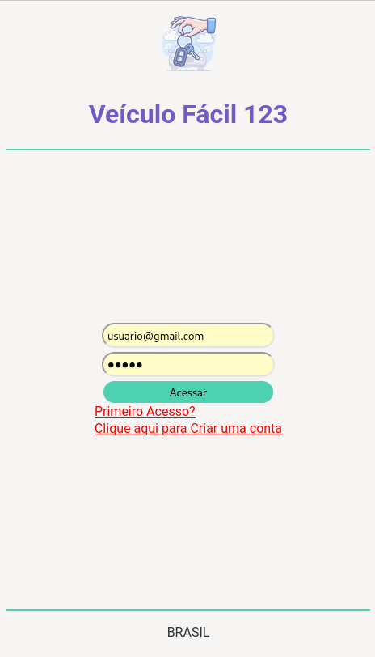

# Projeto Integrador
Projeto integrador da matéria 2203-PROJETO INTEGRADOR: DESENVOLVIMENTO DE SISTEMAS ORIENTADO A DISPOSITIVOS MÓVEIS E BASEADOS NA WEB

# Integrantes do Grupo 17:
Fabricio Macedo Crispim,
Aïcha Abibatou Souza Gueye,
Daniel dos Anjos Veleda,
Gabriel Christino Cordeiro dos Santos,
Gabriel Eugenio de Oliveira

# Como acessar?
Na tela de login, utilizar o usuário **usuario@gmail.com** e a senha **12345**
 

As informações estão "mokadas" no código, não há uma conexão real com um banco de dados.
